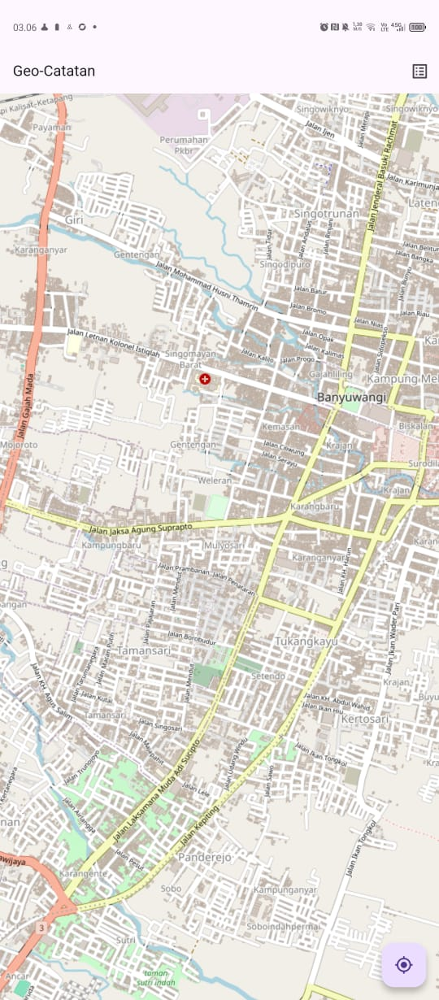
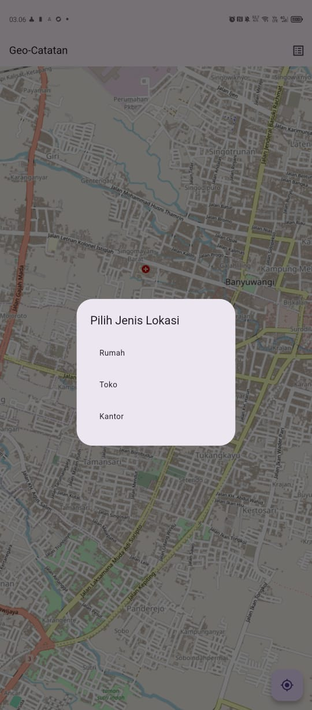
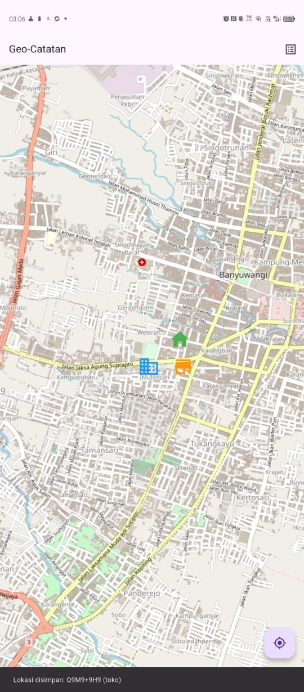
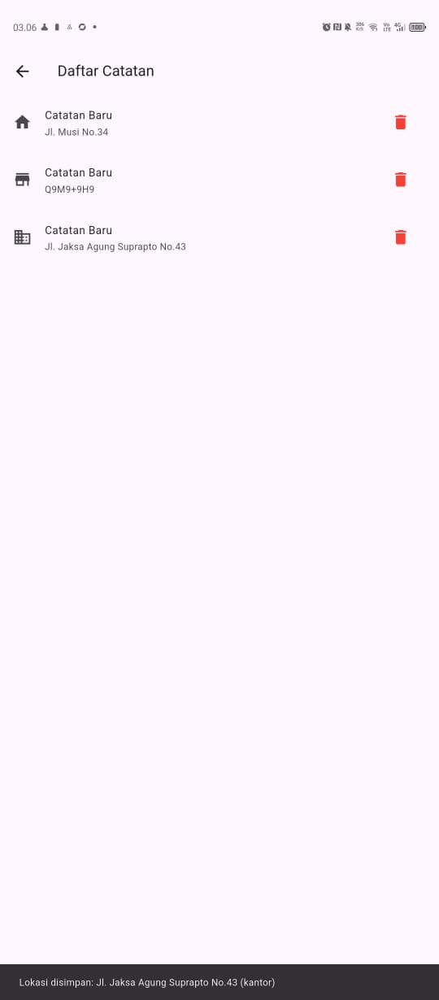

# Laporan Praktikum 
## Aplikasi Geo-Catatan Lokasi
## Penaduhuluan
Laporan ini saya buat setelah melakukan percobaan membuat Aplikasi Geo catatan untuk 
memberi catatan lokasi bagi beberapa tipe yaitu rumah, toko dan kantor setelah itu saya mencoba mengerjakan tugas mandiri 
dengan menambah model bagi tiap" type catatan sepeti rumah dengan gambar rumah, kantor dengan gambar kantor, dan toko
dengan gambar toko serta menambahkan icon untuk menghapus pada catatanya.

## Identitas
Nama  : Ahmad Maulidin
NIM   : 362458302146
Mata Kuliah : Pemrograman Perangkat Bergerak
Dosen : Sepyan Purnama Kristanto, S.Kom., M.Kom.

## Fitur Aplikasi
- Tampilan Peta
- Tambah Marker Dengan Long Press
- Icon Marker Berbeda Berdasarkan Kategori (Rumah / Toko / Kantor)
- Halaman Daftar Catatan
- Hapus Catatan & Marker
- Data Tersimpan Permanen Menggunakan SharedPreferences di dalam cache 

## Tampilan Aplikasi
Berikut merupakan tampilan aplikasi Geo Catatan yang telah dibuat:

### 1. Halaman Peta & Lokasi Address
Menampilkan posisi pengguna secara realtime dan lokasi yang bisa diberi catatan.

### 2. Tampilan Type
Memilih jenis lokasi seperti rumah, toko, atau kantor.

### 3. Tampilan Icon Pada Peta
Icon berubah mengikuti tipe lokasi.

### 4. Tampilan Catatan & Hapus Catatan
Daftar catatan yang tersimpan dan tersedia opsi hapus.

